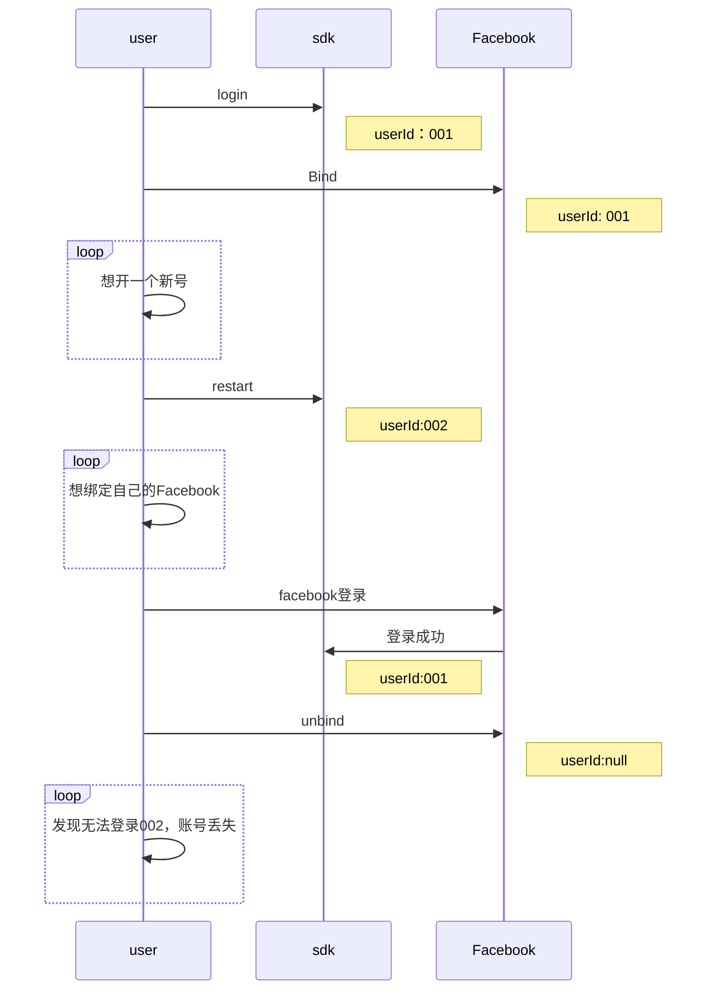

```mermaid
sequenceDiagram
user->>sdk: login
Note right of sdk: userId：001
user->>Facebook: Bind
Note right of Facebook: userId: 001
loop
	user->>user: 想开一个新号
end
user->>sdk:restart
Note right of sdk: userId:002
loop
	user->>user: 想绑定自己的Facebook
end
user->>Facebook: facebook登录
Facebook->>sdk: 登录成功
Note right of sdk: userId:001
user->>Facebook: unbind
Note right of Facebook: userId:null
loop
	user->>user: 发现无法登录002，账号丢失
end
```

