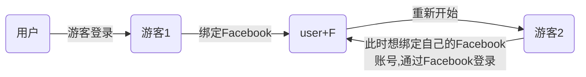
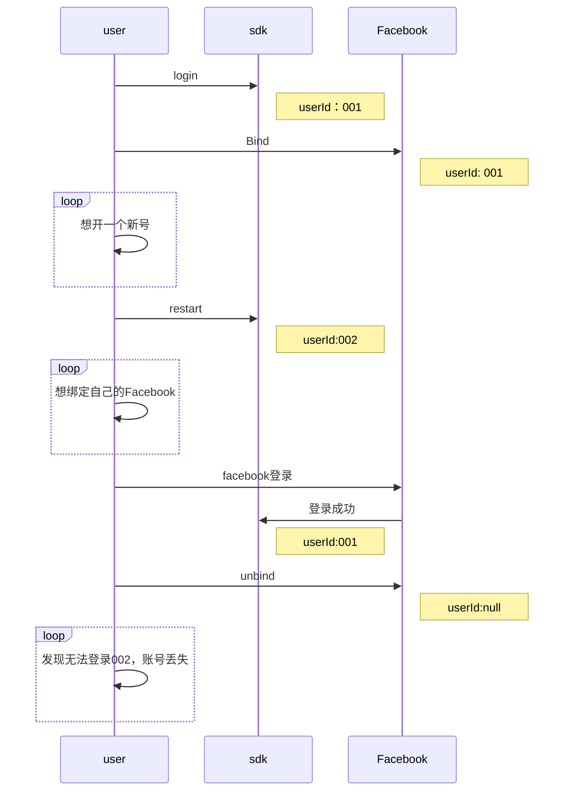

## 09-01

---

**A JavaScript error occurred in the main process**

Could not get code signature for running application

。[参考方法](https://blog.csdn.net/YUICUI/article/details/124821202?spm=1001.2101.3001.6650.4&utm_medium=distribute.pc_relevant.none-task-blog-2%7Edefault%7EESLANDING%7Edefault-4-124821202-blog-121721213.pc_relevant_multi_platform_whitelistv4eslandingctr&depth_1-utm_source=distribute.pc_relevant.none-task-blog-2%7Edefault%7EESLANDING%7Edefault-4-124821202-blog-121721213.pc_relevant_multi_platform_whitelistv4eslandingctr&utm_relevant_index=5)。

一加手机需要先打开禁止权限监控选项

https://blog.csdn.net/YUICUI/article/details/107761763

 查看应用包名

adb连接手机

1、查看当前运行app的包名

adb shell
dumpsys window | grep Focus

2、通过包名查找apk的安装路径

pm path com.tencent.mobileqq
package:/mnt/asec/com.tencent.mobileqq-1/base.apk

3、查看当前运行的Activity名称

adb shell "dumpsys window | grep mCurrentFocus"

4、获取第三方APK的包名和入口类名

打开AndroidStudio
Build -> Analyze APK -> 选择APK文件 -> 找到AndroidManifest.xml文件

DateBinding Android支持双向绑定的插件

https://juejin.cn/post/7115224601830883365

## 08-31

---

1. 自动化测试
2. Apple ID
3. 微信申请应用

## 08-30

---

1. 补充ZeusSDK文档
2. ios支付商品需要重新配置
2. 申请微信应用

## 08-29

---

1. - [ ] 换个思路

   先编辑md文本，编辑结束之后监听md文本的改动和html的改动，之后md文本保存用来编辑，html文本保存用来展示，再次编辑的时候替换html。
   
1. - [x] 修改文档

1. - [x] 创建分支

   

## 08-26

---

1. - [ ] Ace 问卷调查没有回调

   因为ace没有注册zeus的onactivityResult方法

2. 

2022-08-26 22:48:50.181 2656-2833/? E/DatabaseUtils: Writing exception to parcel
    java.lang.SecurityException: No permission to access APN settings
        at com.android.providers.telephony.TelephonyProvider.checkPermission(TelephonyProvider.java:4788)
        at com.android.providers.telephony.TelephonyProvider.checkPermissionCompat(TelephonyProvider.java:4805)
        at com.android.providers.telephony.TelephonyProvider.query(TelephonyProvider.java:3678)
        at android.content.ContentProvider.query(ContentProvider.java:1408)
        at android.content.ContentProvider.query(ContentProvider.java:1504)
        at android.content.ContentProvider$Transport.query(ContentProvider.java:272)
        at android.content.ContentProviderNative.onTransact(ContentProviderNative.java:107)
        at android.os.Binder.execTransactInternal(Binder.java:1179)
        at android.os.Binder.execTransact(Binder.java:1143)
2022-08-26 22:48:50.183 1436-1678/? E/RequestContextBuilder: Could not query TelephonyProvider
    java.lang.SecurityException: No permission to access APN settings
        at android.os.Parcel.createExceptionOrNull(Parcel.java:2425)
        at android.os.Parcel.createException(Parcel.java:2409)
        at android.os.Parcel.readException(Parcel.java:2392)
        at android.database.DatabaseUtils.readExceptionFromParcel(DatabaseUtils.java:190)
        at android.database.DatabaseUtils.readExceptionFromParcel(DatabaseUtils.java:142)
        at android.content.ContentProviderProxy.query(ContentProviderNative.java:481)
        at android.content.ContentResolver.query(ContentResolver.java:1219)
        at android.content.ContentResolver.query(ContentResolver.java:1151)
        at android.content.ContentResolver.query(ContentResolver.java:1107)
        at aevx.b(PG:26)
        at aevs.r(PG:85)
        at aevs.m(PG:38)
        at gkm.call(PG:46)
        at agzh.a(Unknown Source:2)
        at agyl.run(PG:3)
        at agzi.run(Unknown Source:4)
        at java.util.concurrent.ThreadPoolExecutor.runWorker(ThreadPoolExecutor.java:1137)
        at java.util.concurrent.ThreadPoolExecutor$Worker.run(ThreadPoolExecutor.java:637)
        at jbv.run(PG:26)
        at java.lang.Thread.run(Thread.java:1012)

022-08-26 22:59:17.187 10662-11315/? E/AndroidRuntime: FATAL EXCEPTION: UnityMain
    Process: com.topjoy.empire, PID: 10662
    java.lang.NoClassDefFoundError: Failed resolution of: Lcom/topjoy/zeussdk/customerService/MCCustomerServiceAIHelpImpl;
        at com.topjoy.zeussdk.customerService.MCCustomerServiceProxy.<init>(MCCustomerServiceProxy.java:19)
        at com.topjoy.zeussdk.model.MCLoginModel.loginSuccess(MCLoginModel.java:526)
        at com.topjoy.zeussdk.model.MCLoginModel$1.handleMessage(MCLoginModel.java:85)
        at android.os.Handler.dispatchMessage(Handler.java:106)
        at android.os.Looper.loopOnce(Looper.java:201)
        at android.os.Looper.loop(Looper.java:288)
        at com.unity3d.player.UnityPlayer$e.run(Unknown Source:20)
     Caused by: java.lang.ClassNotFoundException: com.topjoy.zeussdk.customerService.MCCustomerServiceAIHelpImpl
        at com.topjoy.zeussdk.customerService.MCCustomerServiceProxy.<init>(MCCustomerServiceProxy.java:19) 
        at com.topjoy.zeussdk.model.MCLoginModel.loginSuccess(MCLoginModel.java:526) 
        at com.topjoy.zeussdk.model.MCLoginModel$1.handleMessage(MCLoginModel.java:85) 
        at android.os.Handler.dispatchMessage(Handler.java:106) 
        at android.os.Looper.loopOnce(Looper.java:201) 
        at android.os.Looper.loop(Looper.java:288) 
        at com.unity3d.player.UnityPlayer$e.run(Unknown Source:20) 

## 08-25

---

1. - [x] 申请QQ，微信，支付宝 开发者账号

   

2. - [x] 解决ace 问卷调查报错

3. - [ ] 准备zeus文档分享

4. - [x] 讨论userlist

5. - [ ] 第三方登录判断方式

6. - [x] 统计各个第三方sdk依赖版本

   adjust：com.adjust.sdk:adjust-android:4.28.9

   SurveyMonkey: com.surveymonkey:surveymonkey-android-sdk:2.0.0

   Facebook :com.facebook.android:facebook-android-sdk:latest.release

   Twitter: com.twitter.sdk.android:twitter-core:3.1.1

   linesdk: com.linecorp.linesdk:linesdk:5.7.0

   Google_login: com.google.android.gms:play-services-auth:18.1.0

   Google_pay: com.android.billingclient:billing:4.0.0

   freshDesk: com.github.freshworks:freshchat-android:5.0.3

   Firebase_analytics: com.google.firebase:firebase-analytics:20.0.2

   Firebase_message: com.google.firebase:firebase-messaging:23.0.0

   thinkingsdk：cn.thinkingdata.android:ThinkingAnalyticsSDK:2.7.0

**服务器添加一个绑定账号失败之后返回旧的用户信息，游戏用户确认，添加一个新的接口，重新绑定第三方，覆盖之前的用户.**

## 08-24

---

1. - [x] 画时序图
2. - [ ] msg返回到有中文
3. - [x] 验证qq登录
4. - [ ] 申请QQ，微信，支付宝 开发者账号
5. - [ ] 第三方登录的判断，现在是按照是否国外分类，需要修改一下
6. - [ ] 准备zeus文档分享

## 08-19

---

文档 

1. 用户反馈

   1. 问卷调查
   2. 客服系统

2. 系统调用

   实现获取设备信息

3. 推送服务

   1. firebase

4. 第三方平台

   1. 国内
      1. Google
      2. line
      3. Facebook
      4. Twitter
      5. ios
   2. 国外
      1. ios
      2. qq
      3. wx

5. 用户中心

6. 账号操作

   1. 登录
   2. ...

7. 社交功能

   1. 分享
   2. 指定平台分享

8. 数据统计

   1. adjust
   2. thinking
   3. Facebook

10. 在线支付

    1. 支付
    2. 订阅

11. 生命周期

    1. 。。。

​	> 自己的放在左边，三方放在右边

每个功能结尾添加参考文档

加架构图

## 08-18

---

1. - [ ] 建议pandora和ace修改各自的AndroidManifest中的FacebookContentProvider为各自appid，否则会出现不能同时安装ace和pandora的情况。

2. - [ ] Facebook登录失败

   https://developers.facebook.com/support/bugs/384347823664311/

3. - [ ] 接入微信登录，QQ登录

   1. 添加lib依赖包

   2. 修改Android Manifest，添加配置项

      从后台找到appid复制到对应的地方

   3. 初始化

      Tencent.setIsPermissionGranted(true);

      

## 需求

1. 限制同一设备创建多个游客账号

   pandora服人数上限2000人，防止小号占用人数名额

2. 账号找回

   可以提供帮助游客账号找回的功能

## 解决方案

1. 提供账号密码

2. 通过GM提供信息，或者设备id，或者表单。

3. 在zeus后台添加账号上限配置

   根据设备id判断当前用户账号数量。

4. 获取设备id问题

   ios设备不给权限的话获取为空，可以设置游客账号为可选项，Android会出现获取id重复的情况。

5. 误操作达到用户上限

   通过GM删除。

### Zeus登录时序图

流程图

时序图

## 08-17

---

1. - [ ] Zeus集成Room存储数据

   https://developer.android.google.cn/training/data-storage/room#java

2. - [ ] 帮助栏添加api对应列表

3. - [ ] 画zeus账号登录时序图

